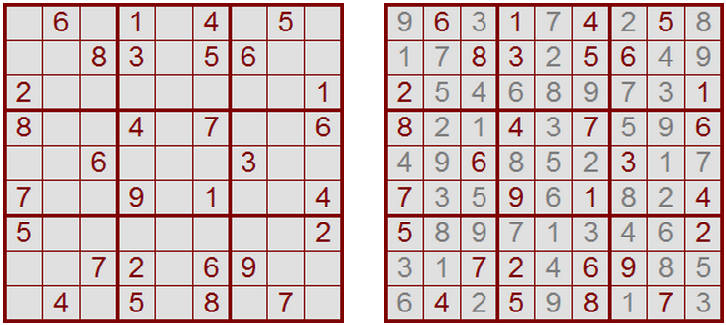

# 989 - Su Doku

In many newspapers we may find some puzzles to solve, one of those is Su Doku. Given a grid 9 × 9
with some of entries filled, the objective is to fill in the grid so that every row, every column, and every
3 × 3 box contains the digits 1 through 9.



 [image source](http://www.sudoku.com)

## Input

Input contains several test cases separated by a blank line. Each of them contains an integer *n* such
that 1 ≤ *n* ≤ 3 and a grid *n<sup>2</sup> × n<sup>2</sup>* with some of the entries filled with digits 
from 1 to *n<sup>2</sup>* (an entrie not filled will have 0). In this case, the objective is to fill in 
the grid so that every row, every column, and every *n × n* box contains the digits 1 through *n<sup>2</sup>*.


## Output

A solution for the problem. If exists more than one, you should give the lower one assuming a lexicographic
order. If there is no solution, you should print ‘NO SOLUTION’. For lexicographic comparison
you should consider lines in first place. Print a blank line between test cases.


## Sample Input

```
3
0 6 0 1 0 4 0 5 0
0 0 8 3 0 5 6 0 0
2 0 0 0 0 0 0 0 1
8 0 0 4 0 7 0 0 6
0 0 6 0 0 0 3 0 0
7 0 0 9 0 1 0 0 4
5 0 0 0 0 0 0 0 2
0 0 7 2 0 6 9 0 0
0 4 0 5 0 8 0 7 0
```

## Sample Output

```
9 6 3 1 7 4 2 5 8
1 7 8 3 2 5 6 4 9
2 5 4 6 8 9 7 3 1
8 2 1 4 3 7 5 9 6
4 9 6 8 5 2 3 1 7
7 3 5 9 6 1 8 2 4
5 8 9 7 1 3 4 6 2
3 1 7 2 4 6 9 8 5
6 4 2 5 9 8 1 7 3
```
